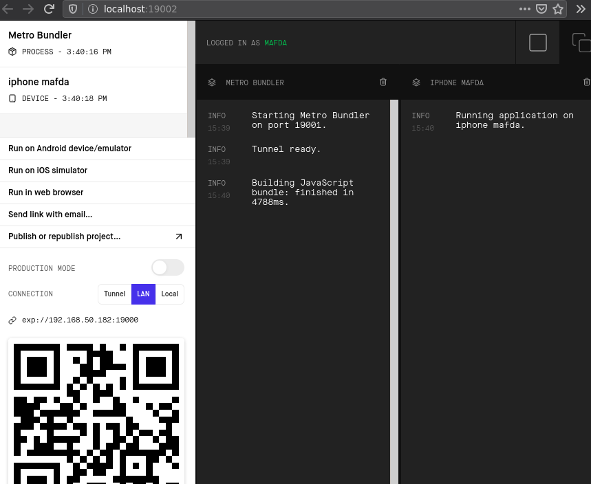
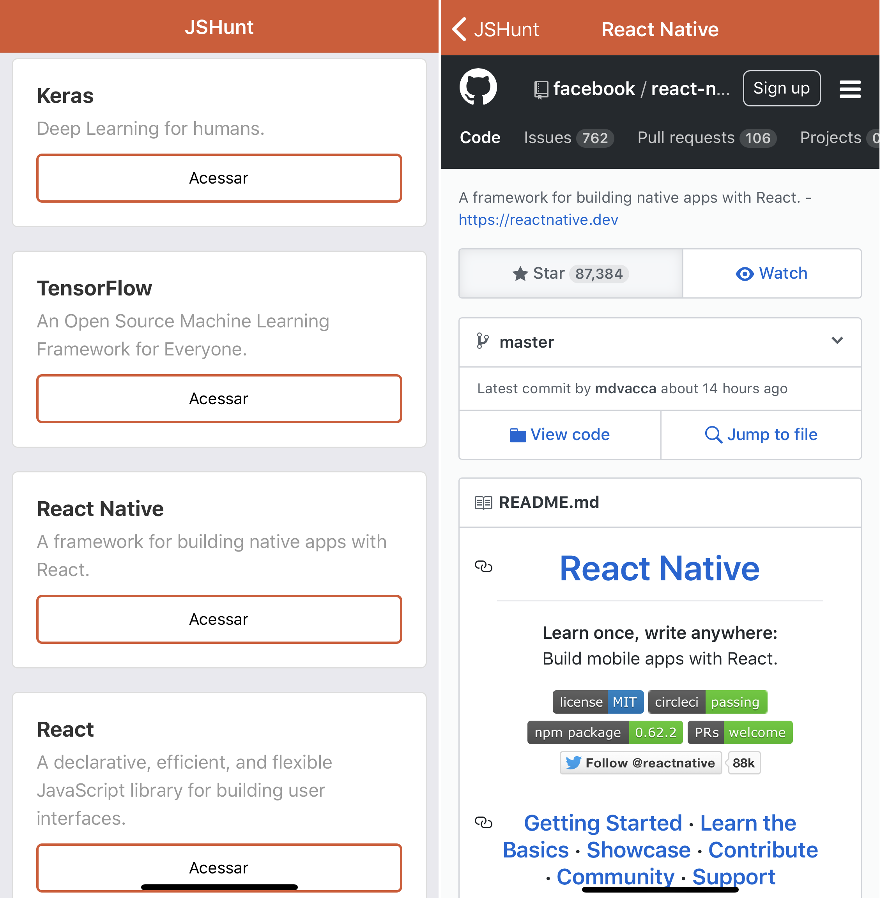

# Visualizar

* **Back-end**

* MongoDB, Robo 3T and Insomnia

```
docker pull mongo
docker run --name mongodb -p 27017:27017 -d --rm mongo
docker ps -a
```

* Localhost
  
```
cd node-api
npm run dev
```
* **Mobile**

* Expo 

```
cd huntmobile
npm start
```




