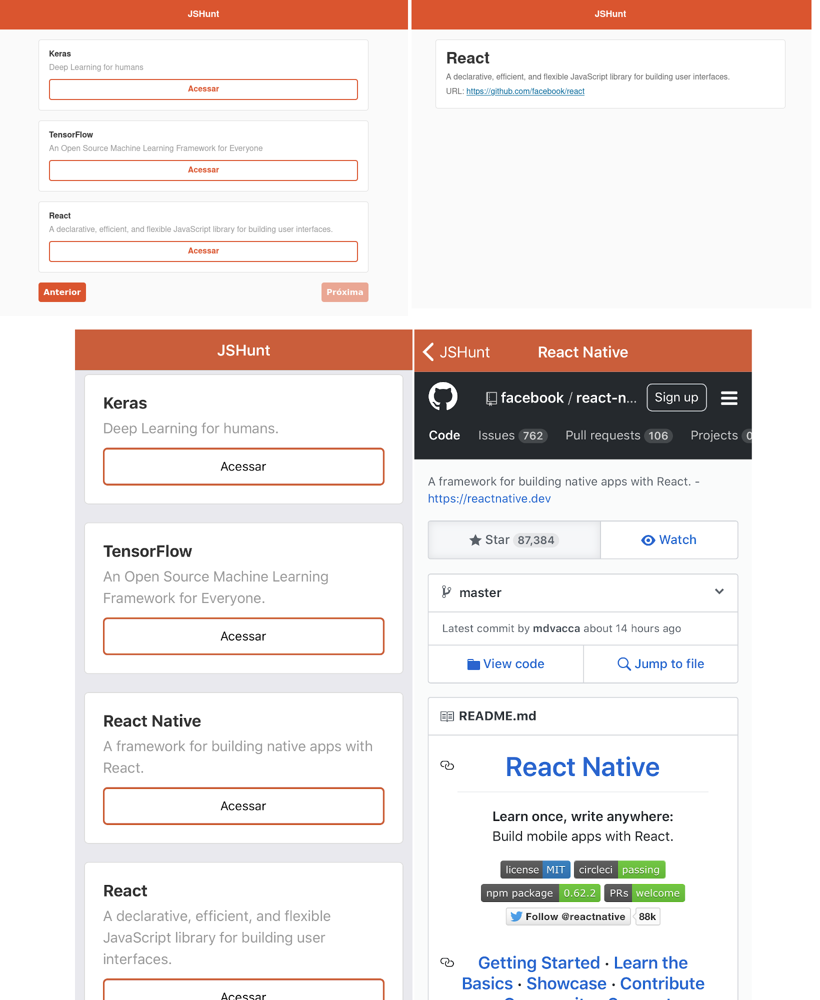

# Curso Starter JavaScript da Rocketseat

[pt-BR] Solução dos desafios JavaScript propostos durante o [Curso Starter](https://skylab.rocketseat.com.br/journey/starter) da [RocketSeat](https://rocketseat.com.br/). 

## JavaScript

* Introdução JavaScript [Desafio](https://github.com/mafda/starter_js/tree/master/01_javascript/exercicios/ex_01)
* Manipulando a DOM [Desafio](https://github.com/mafda/starter_js/tree/master/01_javascript/exercicios/ex_02)
* App de to-do [Exemplo](https://github.com/mafda/starter_js/tree/master/01_javascript/exemplos/todos)
* JS assíncrono [Exemplo](https://github.com/mafda/starter_js/tree/master/01_javascript/exemplos/axios), [Desafio](https://github.com/mafda/starter_js/tree/master/01_javascript/exercicios/ex_04)

## JavaScript ES6

* Conceitos [Desafio]()
* Webpack Server [Desafio]()
* Async/await [Desafio]()
* App ES6+ [Exemplo](https://github.com/mafda/starter_js/tree/master/02_javascript_es6/exemplos/app_es6)

## NodeJS

[Node.js](https://nodejs.org/): Plataforma para criar facilmente aplicativos de rede rápidos e escaláveis.

* node-app [Back-end](https://github.com/mafda/starter_js/tree/master/03_node_js/node-api)
  * Para testar o projeto "node-app", instale o [Insomnia](https://insomnia.rest/) ou execute via docker container [docker-insomnia](https://github.com/camiloariza/docker-insomnia).
  * Para testar a base de dados, instale o [MongoDB](https://www.mongodb.com/) ou execute via docker container [mongo](https://hub.docker.com/_/mongo).
  * Para visualizar a base de dados, instale [Robo 3T](https://robomongo.org/).

## ReactJS

[React.js](https://reactjs.org/): Biblioteca JavaScript para criar interfaces de usuário.

* huntweb [Front-end](https://github.com/mafda/starter_js/tree/master/04_react_js/huntweb)
  * Para testar o projeto "huntweb", instale node-app [Back-end](https://github.com/mafda/starter_js/tree/master/03_node_js/node-api).

## React Native

[React Native](https://reactnative.dev/): Cria aplicativos nativos para Android e iOS.

* huntmobile [Mobile](https://github.com/mafda/starter_js/tree/master/05_react_native/huntmobile)
  * Para testar o projeto "huntweb", instale node-app [Back-end](https://github.com/mafda/starter_js/tree/master/03_node_js/node-api).

### Resultados

* huntweb - huntmobile

---

### Agradecimentos

[Diego Fernandes](https://github.com/diego3g) e a equipe da [Rocketseat](https://rocketseat.com.br/).

